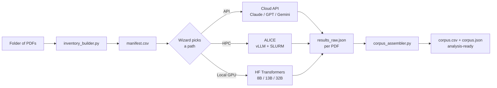

# Corpus Building

*A wizard, five Claude Code skills, and the scripts and templates that glue them together — for turning a folder of PDFs into an analysis-ready text corpus.*

[](https://creativecommons.org/licenses/by/4.0/)
&nbsp;
[](https://scdenney.github.io/corpus-building/)
&nbsp;
[](https://scdenney.github.io/thesis-supervision/)

> **Live wizard:** <https://scdenney.github.io/corpus-building/>

---

## What this is

A **text corpus** is a structured collection of documents — usually one row per article or page, with metadata — ready to load into analysis software like Orange, R, or Python. Getting there from a folder of scanned PDFs involves real decisions: which OCR approach (cloud API vs. HPC vs. a local GPU), what metadata to track, how to structure the output.

This repository bundles:

- **A static web wizard** (`index.html` + `wizard.js` + `wizard.css`) — six questions, a personalised starter kit, a one-line command that launches a Claude Code or Codex session primed with the project's specifics.
- **Five Claude Code skills** covering each decision point (framing, schema design, cloud-API path, HPC path, local-GPU path).
- **Five companion scripts** (PDF inventory, cost estimation, HPC deployment, vLLM health check, corpus assembly).
- **Three templates** (parameterised SLURM job, annotated manifest CSV, prompt module).
- **Three scenario walkthroughs** covering the main execution paths, at realistic student scale (~75 documents).
- **Two embed snippets** for linking from other sites (a mini-wizard and a terminal-style CTA).

Built primarily for students and staff at **Leiden University**, but works for anyone with PDFs and a Claude or OpenAI account. The repo stops at the analysis-ready corpus — what happens *after* (topic modelling, NER, classification, embeddings) is a separate future module.

---

## The pipeline at a glance



---

## Quick starts

### Just want to see what this produces?

Read a worked scenario:

- [**Small corpus via cloud API**](examples/small_api.md) — 75 journal articles, laptop only, roughly $10
- [**Small corpus via ALICE HPC**](examples/small_alice.md) — 75 Polish historical newspapers, free compute
- [**Small corpus on a local GPU**](examples/small_local_gpu.md) — 75 reports, an RTX 3060 12 GB, no cloud cost

### Want to build your own?

Take the [wizard](https://scdenney.github.io/corpus-building/). Answer six questions. The output card gives you:

1. Which skills to read first
2. A one-line terminal command that launches Claude Code or Codex with your project context
3. The templates to copy and the shell invocations to run
4. A pre-filled `mailto:` escalation if your combination is outside the self-serve tool's scope

### Want the skills in Claude Code directly?

Each skill in `skills/` is a standalone `SKILL.md` with YAML frontmatter (name, description, trigger phrases). Two ways to install:

```bash
# Project-level (one project only)
cp -r skills/corpus-from-pdfs /path/to/your/project/.claude/skills/

# User-level (available in any project)
cp -r skills/* ~/.claude/skills/
```

Claude Code reads the frontmatter and offers to invoke the skill when its trigger conditions match. You can also call one directly:

```
/corpus-from-pdfs I have 75 English journal articles and want to use the Claude API.
```

---

## Repository layout

```
corpus-building/
├── index.html + wizard.js + wizard.css   # Static wizard (GitHub Pages)
├── _config.yml + _layouts/                # Jekyll config + layout for rendered .md pages
├── embed/                                  # HTML + CSS snippets for linking from other sites
│   ├── mini-wizard.html                   #   — inline 2-question form
│   ├── terminal-cta.html                  #   — faux-terminal click-to-launch
│   └── README.md                          #   — usage + accepted URL params
├── skills/                                 # Claude Code skills
│   ├── corpus-from-pdfs/                  #   — end-to-end framing
│   ├── corpus-metadata-design/            #   — schema design
│   ├── alice-vllm-deploy/                 #   — HPC deployment
│   ├── api-ocr-runner/                    #   — cloud API path
│   └── hf-transformers-ocr/               #   — local GPU path
├── scripts/                                # Generic CLI tools
│   ├── inventory_builder.py               #   — PDF directory → manifest.csv
│   ├── alice_deploy.sh                    #   — rsync + path rewriting for ALICE
│   ├── vllm_health_check.sh               #   — poll vLLM /health
│   ├── cost_estimator.py                  #   — ballpark API cost
│   └── corpus_assembler.py                #   — per-PDF results → corpus CSV+JSON
├── templates/                              # Fill-in-the-blank starting points
│   ├── run_ocr.slurm.template             #   — two-phase vLLM SLURM job
│   ├── manifest.csv.example               #   — annotated manifest columns
│   └── prompts.py.template                #   — prompt module (two patterns)
├── examples/                               # Scenario walkthroughs (rendered by Pages)
│   ├── small_api.md
│   ├── small_alice.md
│   └── small_local_gpu.md
├── wizard/                                 # Wizard spec (internal)
│   ├── QUESTIONS.md
│   └── STARTER_KIT.md
├── SOURCES.md                              # Bibliography
├── CLAUDE.md                               # Project notes
├── LICENSE                                 # CC BY 4.0
└── README.md                               # You are here
```

---

## New to Claude Code or Codex?

The starter kit will tell you which skills to read and which commands to run, but the surrounding workflow — structuring the project, writing a `CLAUDE.md` or `AGENTS.md`, managing what the agent knows and remembers — is its own skill. Rather than duplicate that material here, these are the best sources to start with.

**Official docs**

- [Claude Code Best Practices](https://www.anthropic.com/engineering/claude-code-best-practices) — Anthropic Engineering's canonical guide: `CLAUDE.md` conventions, `.claude/commands/` for reusable slash commands, and the plan → small-diff → tests → review loop.
- [Claude Code: Memory](https://code.claude.com/docs/en/memory) — the full `CLAUDE.md` hierarchy (user / project / subdirectory / local) and auto-memory.
- [Claude Code: Settings](https://code.claude.com/docs/en/settings) — `.claude/settings.json`, permissions (allow / deny / ask), hooks, precedence rules.
- [Custom Instructions with AGENTS.md](https://developers.openai.com/codex/guides/agents-md) — Codex's counterpart to `CLAUDE.md`.
- [Codex CLI Quickstart](https://developers.openai.com/codex/quickstart) — installation, auth, the three approval modes.
- [Skill Authoring Best Practices](https://platform.claude.com/docs/en/agents-and-tools/agent-skills/best-practices) — when to write a skill vs. a direct prompt; directly relevant if you adapt the skills in this repo.

**Practitioner voices**

- [Agentic Engineering Patterns](https://simonwillison.net/guides/agentic-engineering-patterns/) — Simon Willison's living tool-agnostic guide to working with Claude Code and Codex.
- [Mitchell Hashimoto's New Way of Writing Code](https://newsletter.pragmaticengineer.com/p/mitchell-hashimoto) — the "always have an agent doing something" workflow and the test-harness pattern (turn every agent mistake into a rule in `CLAUDE.md`).
- [How to Build a Coding Agent](https://ghuntley.com/agent/) — Geoffrey Huntley's workshop; demystifies what an agent actually is (a loop + tools + LLM) and why pitfalls like context bloat and drift happen.

Codex-specific practitioner writing is thin in early 2026 — most named voices focus on Claude Code. Both tools work for this repo's skills and commands.

---

## Using the scripts standalone

The scripts work independently of Claude Code. Minimal pipeline:

```bash
# 1. Build a manifest from a folder of PDFs
python3 scripts/inventory_builder.py --pdf-dir ./pdfs --output manifest.csv

# 2. (API path) estimate the cost before committing
python3 scripts/cost_estimator.py --pages 750 --compare

# 3. Run OCR (client script — build with Claude Code's help, per the
#    api-ocr-runner / hf-transformers-ocr / alice-vllm-deploy skill).
#    Produces ocr_output/<pdf_id>/results_raw.json per document.

# 4. Assemble the final corpus
python3 scripts/corpus_assembler.py --ocr-dir ocr_output \
    --manifest manifest.csv --output corpus/
```

Each script supports `--help` for the full options.

---

## Embedding on another site

Two self-contained snippets in `embed/` for linking to the wizard from another page:

- `embed/mini-wizard.html` — a two-question form that routes to the full wizard with the two answers pre-filled via URL parameters
- `embed/terminal-cta.html` — a faux-terminal clickable card with a typed-command animation

Both are plain HTML + CSS (no JS), scoped with a `cb-` class prefix. Drop-in anywhere raw HTML renders (most static-site generators qualify). See `embed/README.md` for accepted URL parameters.

---

## Context

This repo is the **computational-methods deep dive** that pairs with the corpus-building primer on [*Thesis Supervision*](https://scdenney.github.io/thesis-supervision/methods/building-a-corpus). Students who need a gentle conceptual introduction start there; students whose projects require LLM-based OCR, programmatic pipelines, or HPC deployment continue here.

The repo is deliberately **standalone** so it can evolve independently — plugins, skills, and templates mature on their own cadence; the supervision site links in rather than duplicating content.

---

## License

This work is licensed under a [Creative Commons Attribution 4.0 International License (CC BY 4.0)](https://creativecommons.org/licenses/by/4.0/).

You're free to share and adapt for any purpose, including commercial, as long as you give appropriate credit. Use, fork, and remix encouraged — especially for teaching.

See [`LICENSE`](LICENSE) for the full legal text.

---

*Developed by [Dr. Steven Denney](https://scdenney.github.io/thesis-supervision/) at Leiden University, Faculty of Humanities.*
