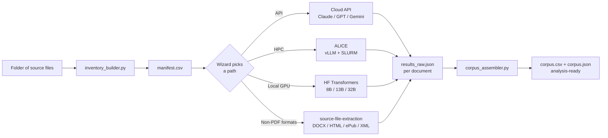

# Corpus Building

*A wizard, six Claude Code skills, and the scripts and templates that connect them — for turning a folder of documents (PDFs, DOCX, HTML, ePub, XML, plain text) into an analysis-ready text corpus.*

&nbsp;

&nbsp;

> **Live wizard:** <https://scdenney.github.io/corpus-building/>

---

## What this is

A **text corpus** is a structured collection of documents — usually one row per article or page, with metadata — ready to load into analysis software like Orange, R, or Python. Getting there from a folder of source files (PDFs most often, but also Word documents, HTML, ePub, XML, plain text) involves real decisions: which extraction or OCR approach to use, what metadata to track, how to structure the output. The repo gives you a wizard that picks sensible defaults, a set of Claude Code skills that codify the choices, and the scripts and templates that make the pipeline reproducible.

Built primarily for students and staff at **Leiden University**, but works for anyone with documents and a Claude or OpenAI account. The repo stops at the analysis-ready corpus — what happens *after* (topic modeling, NER, classification, embeddings) is a separate future module.

## The pipeline at a glance

---

## Quick start

**See what it produces.** Start with a student-scale example (~75 documents):

- [Small corpus via cloud API](examples/small_api.md) — Korean newspaper editorials, laptop only, ~$10
- [Small corpus via ALICE HPC](examples/small_alice.md) — historical Korean newspapers, free compute
- [Small corpus on a local GPU](examples/small_local_gpu.md) — RTX 3060, no cloud cost

**Build your own.** Take the [wizard](https://scdenney.github.io/corpus-building/). Six questions in, you have a starter kit: which skills to read, which templates to copy, and a one-line terminal command that launches Claude Code or Codex already primed with your specifics.

**Use the skills in Claude Code directly.** Each skill in `skills/` has YAML frontmatter with trigger phrases; Claude Code auto-detects them. Install project-level (`cp -r skills/corpus-from-pdfs /your/project/.claude/skills/`) or user-level (`cp -r skills/* ~/.claude/skills/`). Call one explicitly with `/corpus-from-pdfs I have 75 Korean newspaper editorials...`.

---

## What's inside

**Skills** (`skills/`) — the decisions:
[corpus-from-pdfs](skills/corpus-from-pdfs/SKILL.md) ·
[source-file-extraction](skills/source-file-extraction/SKILL.md) ·
[corpus-metadata-design](skills/corpus-metadata-design/SKILL.md) ·
[api-ocr-runner](skills/api-ocr-runner/SKILL.md) ·
[hf-transformers-ocr](skills/hf-transformers-ocr/SKILL.md) ·
[alice-vllm-deploy](skills/alice-vllm-deploy/SKILL.md)

**Scripts** (`scripts/`) — the mechanics (each supports `--help`):
`inventory_builder.py` · `cost_estimator.py` · `vllm_health_check.sh` · `alice_deploy.sh` · `corpus_assembler.py`

**Templates** (`templates/`) — fill-in starting points:
`run_ocr.slurm.template` · `manifest.csv.example` · `prompts.py.template`

**Scenarios** (`examples/`) — narrated walkthroughs that the wizard's cold-entry links to.

**Embed snippets** (`embed/`) — self-contained HTML + CSS blocks for linking to the wizard from another site (mini-wizard form + faux-terminal clickable card). See [`embed/README.md`](embed/README.md).

---

## New to Claude Code or Codex?

The starter kit will tell you which skills to read and which commands to run, but the surrounding workflow — structuring the project, writing a `CLAUDE.md` or `AGENTS.md`, managing what the agent knows and remembers — is its own skill. Rather than duplicate that material here, these are the best sources to start with.

**Official docs**

- [Claude Code Best Practices](https://www.anthropic.com/engineering/claude-code-best-practices) — Anthropic Engineering's canonical guide: `CLAUDE.md` conventions, `.claude/commands/` for reusable slash commands, the plan → small-diff → tests → review loop.
- [Claude Code: Memory](https://code.claude.com/docs/en/memory) — the full `CLAUDE.md` hierarchy (user / project / subdirectory / local) and auto-memory.
- [Claude Code: Settings](https://code.claude.com/docs/en/settings) — `.claude/settings.json`, permissions (allow / deny / ask), hooks, precedence rules.
- [Custom Instructions with AGENTS.md](https://developers.openai.com/codex/guides/agents-md) — Codex's counterpart to `CLAUDE.md`.
- [Codex CLI Quickstart](https://developers.openai.com/codex/quickstart) — installation, auth, the three approval modes.
- [Skill Authoring Best Practices](https://platform.claude.com/docs/en/agents-and-tools/agent-skills/best-practices) — when to write a skill vs. a direct prompt; directly relevant if you adapt the skills in this repo.

**Practitioner voices**

- [Agentic Engineering Patterns](https://simonwillison.net/guides/agentic-engineering-patterns/) — Simon Willison's living tool-agnostic guide.
- [Mitchell Hashimoto's New Way of Writing Code](https://newsletter.pragmaticengineer.com/p/mitchell-hashimoto) — "always have an agent doing something" workflow + the test-harness pattern (turn every agent mistake into a rule in `CLAUDE.md`).
- [How to Build a Coding Agent](https://ghuntley.com/agent/) — Geoffrey Huntley's workshop; demystifies what an agent actually is (a loop + tools + LLM) and why pitfalls like context bloat and drift happen.

Codex-specific practitioner writing is thin in early 2026 — most named voices focus on Claude Code. Both tools work for this repo's skills and commands.

---

## Context

This repo is the computational-methods deep dive that pairs with the corpus-building primer on [*Thesis & Research Supervision*](https://scdenney.github.io/thesis-supervision/methods/building-a-corpus). Students who need a conceptual introduction start there; students whose projects require LLM-based OCR, programmatic pipelines, HPC deployment, or non-PDF source handling continue here.

The repo is deliberately **standalone** so it can evolve independently — skills, templates, and the wizard mature on their own cadence; the supervision site links in rather than duplicating content.

---

## License

This work is licensed under a [Creative Commons Attribution 4.0 International License (CC BY 4.0)](https://creativecommons.org/licenses/by/4.0/). You're free to share and adapt for any purpose, including commercial, as long as you give appropriate credit. See [`LICENSE`](LICENSE) for the full notice.

Use, fork, and remix encouraged — especially for teaching.

---

*Developed by [Dr. Steven Denney](https://scdenney.github.io/thesis-supervision/) at Leiden University, Faculty of Humanities.*
